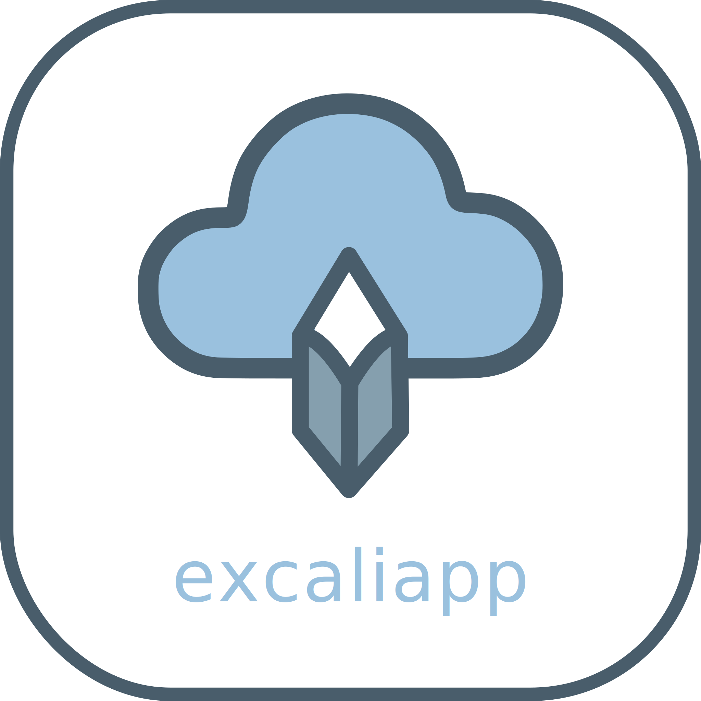
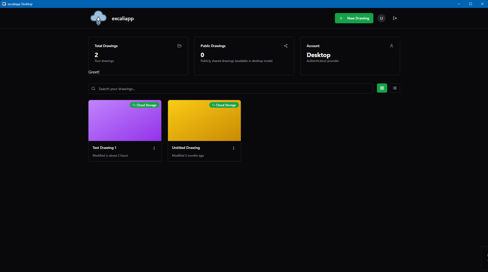
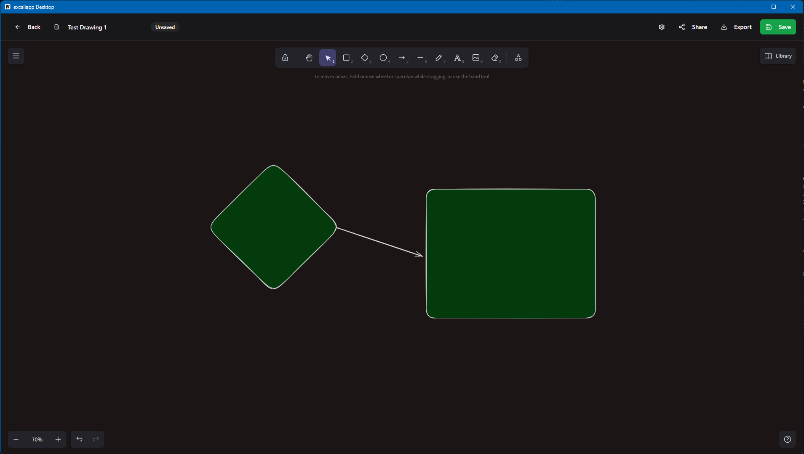

# Excaliapp
Excaliapp is a distribution of Excalidraw with some added functionality

- Desktop application built with [Wails](https://wails.io/)
- Cloudflare Workers backend for online storage and authentication
- Local browser mode for offline use
- Easier loading/saving compared to the export/import method of the base Excalidraw app


## Browser Mode
This is a local instance of Excalidraw that does not require an internet connection. It uses the browser's local storage to save drawings, and does not require auth. This is what is used in the demo version.

```bash
pnpm install
pnpm run dev --mode=browser
```

## Cloudflare Mode
This is a cloud-based instance of Excalidraw that uses Cloudflare Workers and D1 databases to store drawings, it can also be run locally with wrangler/workerd. It requires an OIDC provider for authentication, and uses the `react-oidc-context` library to handle authentication.

```bash
pnpm install
npx wrangler d1 create excalidraw-db
npx wrangler d1 execute worker/schema.sql --database=excalidraw-db
pnpm run dev --mode=cloudflare
```


## Screenshots

